<!--

  <h1 style="color: #00FF00; margin-bottom: 0;">$ Hello, I'm Hyesook</h1>
  
Welcome to my GitHub

  
  

    <pre style="color: #00FF00; background: black; padding: 10px; border-radius: 5px; font-family: monospace;">
  <code>
> echo "✔ Backend Intern  (2023.01 - 2023.04) @ mobileappdev"
> echo "✔ Cloud Engineer  (2023.08 - 2025.07) @ Megazone Cloud"
> echo "✔ DevOps Engineer (2025.08 - now)     @ Supergate"
  </code>
    </pre>
  

-->

  

 

  
  
  
  
  

 
 

  
<!--   

    
    
  
 -->

 
